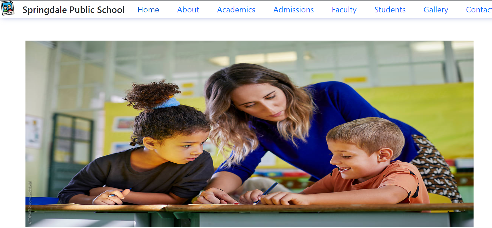

<!-- # React + Vite

This template provides a minimal setup to get React working in Vite with HMR and some ESLint rules.

Currently, two official plugins are available:

- [@vitejs/plugin-react](https://github.com/vitejs/vite-plugin-react/blob/main/packages/plugin-react/README.md) uses [Babel](https://babeljs.io/) for Fast Refresh
- [@vitejs/plugin-react-swc](https://github.com/vitejs/vite-plugin-react-swc) uses [SWC](https://swc.rs/) for Fast Refresh -->


# Springdale Public School Website

Welcome to the Springdale Public School website repository! This project aims to create a user-friendly, informative, and visually appealing website for the school. Below are the instructions on how to set up and run the project, along with additional notes and documentation.

## Table of Contents

- [Project Description](#project-description)
- [Features](#features)
- [Installation](#installation)
- [Usage](#usage)
- [Contributing](#contributing)
- [License](#license)
- [Contact](#contact)
- [Acknowledgements](#acknowledgements)

## Project Description

This project is designed to showcase the school’s infrastructure, facilities, and admission process. It includes various sections such as:

- Home Page
- About Us
- Facilities
- Admission Process
- Contact Us

## Features

- Responsive design using Bootstrap.
- Interactive UI components.
- Dynamic content sections.
- User-friendly navigation.

## View


## Installation

To set up the project locally, follow these steps:

1. **Clone the repository:**

   ```bash
   git clone https://github.com/your-username/springdale-public-school.git
   cd springdale-public-school
2. **Install dependencies:**


npm install


3. **Run the development server:**


npm start


4. **Open the application in your browser:**

Navigate to http://localhost:3000 to see the website in action.

Usage
Development: Use npm start to start the development server.
Build: Use npm run build to create a production build.
Deploy: Deploy the contents of the build folder to your web server or hosting service.
Contributing
We welcome contributions to improve the project! If you’d like to contribute, please follow these guidelines:

5. **Fork the repository.**
Create a new branch for your feature or bug fix.
Make your changes and commit them with clear messages.
Push your changes to your fork.
Submit a pull request.
Code of Conduct
Please follow the Contributor Covenant Code of Conduct when contributing to this project.

License
This project is licensed under the MIT License. See the LICENSE file for details.

Contact
For any questions or feedback, feel free to contact us:

Email: info@springdale.com
Website: www.springdale.com
Acknowledgements
Bootstrap for the responsive design.
React for building the user interface.
Vite for the development server and build tools.
Thank you for visiting the Springdale Public School website repository!

This README was generated with ❤️ by Kush Sahu.


### Additional Files

To complete your repository, you should also include the following files:

1. **LICENSE**: Add the license text. For MIT, you can use a standard MIT license template.
   
2. **CODE_OF_CONDUCT.md**: If you have a code of conduct, include it here. You can find templates online.

3. **.gitignore**: Ensure you have a `.gitignore` file to exclude files like `node_modules`, `.env`, and build artifacts. Here’s a basic example for a Node.js project:

   ```plaintext
   # Node.js dependencies
   /node_modules/

   # Build output
   /dist/
   /build/

   # Environment files
   .env

   # Log files
   *.log

   # IDE or editor directories
   .vscode/
   .idea/

   # System Files
   .DS_Store
   Thumbs.db
With this setup, your GitHub repository will be well-documented and ready for collaboration! Let me know if you need any more details or help with anything else.
